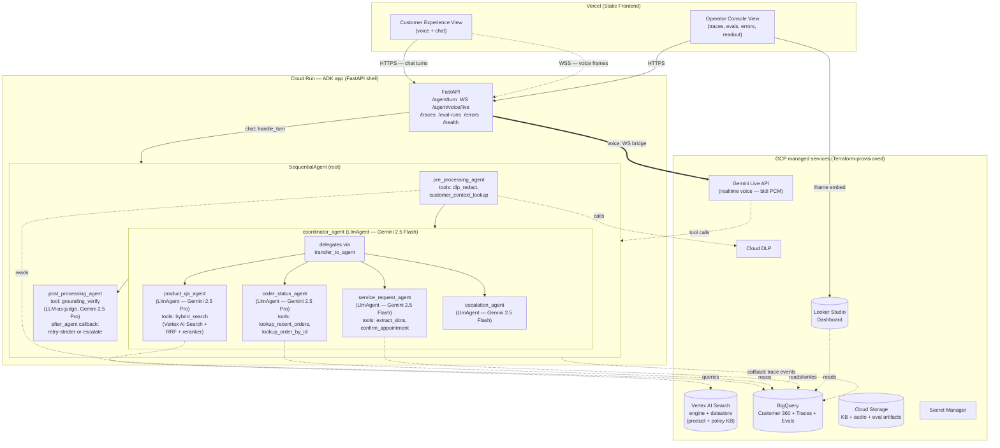

# ContactPulse — Architecture

> **Read first:** [`SPEC.md`](./SPEC.md) — concepts, journeys, surfaces, and modalities this document realizes.

---

## 1. System Overview

ContactPulse is a multi-agent conversational AI system on Google Cloud, with a first-class evaluation and observability layer. It is delivered as a single web application with two views — Customer Experience (the workload) and Operator Console (the data scientist's workspace) — sharing one backend.

The backend is a **Vertex AI Agent Development Kit (ADK)** application. The agent system is an **ADK agent hierarchy**: a top-level `SequentialAgent` wraps `pre_processing_agent` → `coordinator_agent` (an `LlmAgent` whose `sub_agents` are the per-journey specialists) → `post_processing_agent`. Tools (DLP redaction, customer-context lookup, hybrid search, BigQuery order lookups, slot extraction, grounding verification) are typed Python functions registered on the appropriate agents. Control flow that would have been an `if`/`elif` ladder lives in two places: the coordinator's instructions (which sub-agent to delegate to) and ADK callbacks (`after_model` enforces the confidence gate; `after_agent` triggers the grounding retry loop).

Chat goes through the per-turn pipeline (`POST /agent/turn`). Voice is realtime via Vertex AI's Gemini Live API (`WS /agent/voice/live`) — Gemini owns VAD, turn detection, barge-in, and streaming TTS; tools registered on the Live session wrap the same repositories the chat pipeline uses, so business logic is shared even though the runtime shapes differ. See §4.1 (chat) and §4.3 (voice).

All GCP resources behind the API — BigQuery, Cloud Run, Vertex AI Search engine + datastore, GCS buckets, IAM, DLP templates, Secret Manager — are declared in `infra/terraform/`. The Terraform tree is the only sanctioned way to mutate cloud state.



The Vercel ↔ Cloud Run boundary is the only network hop the frontend crosses. Everything inside Cloud Run runs in-process inside the ADK runtime. The Operator Console reads from the backend's `/traces`, `/eval-runs`, and `/errors` endpoints; the embedded Looker dashboard reads BigQuery directly.

---

## 2. GCP Services & Hosting Map

| Layer | Service | Why |
|---|---|---|
| Frontend hosting | **Vercel** (not GCP) | Zero-friction CI/CD, preview deploys, edge caching. The frontend is static asset delivery; no hiring signal lost by hosting outside GCP. |
| Voice (realtime) | **Vertex AI Gemini Live API** (`gemini-live-2.5-flash-native-audio`) | Bidirectional PCM streaming, server VAD, native barge-in, streaming TTS, tool calls. Replaces the Speech-to-Text v2 + Text-to-Speech v1 batch helpers used in v1.3. See §4.3 and CLAUDE.md §14. |
| Backend hosting | **Cloud Run** | Serverless, scales to zero, free tier covers demo, fits MVP cost profile. |
| Orchestration | **Vertex AI Agent Development Kit (ADK)** — pinned to a specific minor version in `requirements.txt` | GCP-native multi-agent framework. Provides agent definitions (`LlmAgent`, `SequentialAgent`, `LoopAgent`, `ParallelAgent`), typed tool registration, native sub-agent delegation, lifecycle callbacks for observability, and a deterministic `Runner` for testing. Forward-compatible with the **A2A (Agent-to-Agent) protocol** for cross-app handoffs. The agent hierarchy in `backend/contactpulse/orchestration/agents.py` is the source of truth for "what the agent does." Version pinned (no `>=`) because ADK is pre-1.0; bumping requires a smoke-eval pass. |
| LLM (routing, slot extraction, judges) | **Gemini 2.5 Flash** | Cheap, fast — production-realistic for high-volume intent routing and rubric-based judging. |
| LLM (synthesis & verification) | **Gemini 2.5 Pro** | Higher quality where it matters: response generation and grounding judgment. |
| Retrieval | **Vertex AI Search** (engine + datastore) | Managed indexing and serving over the synthetic product + policy KB. |
| Hybrid retrieval augmentation | **Vertex AI Search semantic + keyword query → RRF → cross-encoder reranker** (Vertex AI ranking API; Gemini Flash judge as fallback) | Improves recall and precision over vanilla semantic search. Implemented in `backend/contactpulse/retrieval/`. |
| Data warehouse | **BigQuery** | Customer 360, orders, eval traces, conversation logs. SQL-native analytics. |
| Object storage | **Cloud Storage** | KB source documents, audio recordings, eval artifacts, Terraform state backend. |
| Safety (PII) | **Cloud DLP** (`deidentify_content`) with regex fallback when DLP circuit opens | De-identification at the input boundary, before any prompt sees the utterance. |
| Eval orchestration | Vertex AI Evaluation + custom LLM-as-judge | Hybrid: managed where it works, custom where rubrics need to be project-specific. |
| Observability | Cloud Logging + Cloud Trace + Looker Studio + per-callback BQ trace events | Standard GCP observability stack, augmented with ADK lifecycle-callback telemetry (`before_*` / `after_*` hooks → BQ rows). |
| Industry analog (production reference) | **Vertex AI Conversational Insights** | The product a large retailer would deploy in production for CX call/chat analytics. ContactPulse's Operator Console is an in-app slice of the same pattern, reading the same BigQuery tables. Our schema is intentionally compatible so the data layer transfers cleanly. Out-of-scope to actually integrate for the MVP. |
| **Infrastructure as code** | **Terraform** (state in GCS) | All GCP resources above are declared under `infra/terraform/`. Manual `gcloud` mutations are drift, not changes. |
| CI/CD (backend) | GitHub Actions → Cloud Build → Cloud Run | Standard pattern; reproducible deploys. Terraform plan/apply runs in a separate workflow gated on manual approval. |
| CI/CD (frontend) | GitHub Actions → Vercel (auto-deploy on push to `main`) | Vercel's git integration handles this natively. |

### 2.1 Cloud Run Configuration (backend)

| Setting | Value | Rationale |
|---|---|---|
| Region | `us-central1` | Lowest Vertex latency from Atlanta; cheapest pricing tier. |
| Min instances | `1` | Avoid cold starts during the demo. Drop to `0` after the role is filled. |
| Max instances | `5` | Cost ceiling protection. |
| CPU | 1 vCPU | Sufficient for FastAPI + Vertex client. |
| Memory | 2 GiB | Handles concurrent requests + Gemini SDK overhead. |
| Concurrency | `10` | FastAPI async handles concurrency; multiple turns in flight per instance. |
| Timeout | `60s` | Gemini Pro tail latency can hit 15s; 60s gives headroom. |
| Authentication | Allow unauthenticated (MVP) | Lock down post-demo if extending. |
| Workload identity | Bound to `contactpulse-api@<project>.iam.gserviceaccount.com` | Least-privilege access to BQ, Vertex, Cloud Storage. |
| Ingress | All traffic | Vercel needs HTTPS access. |
| CORS | Allow `https://contactpulse.vercel.app` (and preview domains via regex) | No `*`. |

### 2.2 Vercel Configuration (frontend)

| Setting | Value |
|---|---|
| Framework preset | Vite |
| Build command | `npm run build` |
| Output directory | `dist` |
| Node version | `20` |
| Environment variable | `VITE_API_BASE_URL=https://contactpulse-api-XXXXXX-uc.a.run.app` |
| Auto-deploy branch | `main` |
| Preview deploys | Enabled (every PR) |

### 2.3 Infrastructure as Code (Terraform)

All GCP resources are declared in `infra/terraform/` and managed via `terraform plan` / `terraform apply`. State is stored remotely in a GCS bucket (`gs://${PROJECT_ID}-contactpulse-tfstate`) with object versioning enabled and lifecycle policies retaining the last 90 days of state.

**Modules (Terraform-managed — the static plane):**

| Module | Owns |
|---|---|
| `modules/bigquery` | The `contactpulse` dataset; tables `customers`, `orders`, `service_requests`, `conversations`, `conversation_traces`, `eval_runs`; partitioning + clustering on `created_at` and `trace_id`. |
| `modules/cloud_run` | The `contactpulse-api` service, revision configuration, traffic policy, IAM invoker bindings, env vars (referenced from Secret Manager). |
| `modules/gcs` | Buckets: `${PROJECT}-contactpulse-kb`, `${PROJECT}-contactpulse-evals`, `${PROJECT}-contactpulse-audio`, `${PROJECT}-contactpulse-tfstate`. Uniform bucket-level access; lifecycle on audio. |
| `modules/iam` | Service accounts: `contactpulse-api`, `contactpulse-eval`, `contactpulse-deployer`. Least-privilege role bindings (BQ data editor scoped to the dataset, Vertex AI user, GCS object admin scoped to the project's buckets, Discovery Engine user for search-engine query access). |
| `modules/dlp` | DLP inspect + deidentify templates (PERSON_NAME, PHONE_NUMBER, EMAIL_ADDRESS, STREET_ADDRESS, CREDIT_CARD_NUMBER). |
| `modules/secret_manager` | Secrets consumed by Cloud Run via env-var-from-secret bindings (no secrets in plain env vars). |
| `modules/apis` | `google_project_service` resources enabling required APIs (`aiplatform`, `discoveryengine`, `bigquery`, `run`, `texttospeech`, `speech`, `cloudbuild`, `secretmanager`, `dlp`). |

**Script-managed (deliberate carve-out):**

| Resource | Owned by | Why not Terraform |
|---|---|---|
| Vertex AI Search **engine + datastore + serving config** | `scripts/index_kb.py` | Terraform provider coverage for `discoveryengine` is uneven and engine-creation Terraform plans regularly need `null_resource` + `gcloud` shell-outs. A one-shot Python script with idempotent create-or-update + a polling loop is the honest, faster choice for the MVP. The script reads engine/datastore IDs from a `terraform output`-produced fixture and exports the resulting serving-config ID into Secret Manager so the backend's `Settings` reads it the same way it reads any other config value. **Deferred to Terraform when the provider stabilizes** — tracked as a `// TODO(infra)` in `infra/terraform/README.md`. |

**Environments:** `infra/terraform/envs/dev/` and `infra/terraform/envs/prod/` each have their own `terraform.tfvars` and remote-state prefix. The same modules are reused across environments.

**Workflow:**
- Local: `make tf-plan ENV=dev`, `make tf-apply ENV=dev`.
- CI: a `terraform-plan` GitHub Actions job runs on every PR touching `infra/terraform/**` and posts the plan as a PR comment.
- CD: `terraform apply` is gated behind manual approval in the `terraform-apply` workflow.

**Drift policy:** if `terraform plan` shows drift, the drift is reverted, not codified. Out-of-band `gcloud` mutations are treated as incidents, not features.

---

## 3. Repository Layout (Separation of Concerns)

```
contactpulse/
├── README.md                       # Public-facing project intro
├── SPEC.md                         # Product spec
├── ARCHITECTURE.md                 # This file
├── RUNBOOK.md                      # Operations
├── CLAUDE.md                       # Instructions for AI coding agents
├── pyproject.toml                  # Python deps
├── Dockerfile                      # Backend container
├── Makefile                        # Standard developer entry points
├── .env.example                    # Sample config, never with secrets
├── .github/workflows/
│   ├── ci.yml                      # Lint + tests + eval-as-test (backend & frontend)
│   └── deploy.yml                  # Cloud Run deploy (frontend auto-deploys via Vercel)
├── infra/
│   ├── terraform/                  # ALL GCP resources — single source of truth
│   │   ├── envs/
│   │   │   ├── dev/
│   │   │   │   ├── main.tf
│   │   │   │   ├── backend.tf      # Remote state in GCS
│   │   │   │   └── terraform.tfvars
│   │   │   └── prod/
│   │   ├── modules/
│   │   │   ├── apis/               # google_project_service enables
│   │   │   ├── iam/                # Service accounts + least-priv bindings
│   │   │   ├── bigquery/           # Dataset + tables (partitioned, clustered)
│   │   │   ├── gcs/                # KB / evals / audio / tfstate buckets
│   │   │   ├── vertex_search/      # Engine + datastore + serving config
│   │   │   ├── cloud_run/          # contactpulse-api service + IAM
│   │   │   ├── dlp/                # Inspect + deidentify templates
│   │   │   └── secret_manager/     # Secret resources + accessor bindings
│   │   └── README.md               # How to plan/apply/destroy per env
│   └── seed_data/                  # Synthetic data generators (KB docs, eval set)
├── backend/
│   ├── contactpulse/
│   │   ├── __init__.py
│   │   ├── config.py               # 12-factor: env-driven config (Pydantic Settings)
│   │   ├── logging_setup.py        # Structured JSON logging
│   │   ├── tracing.py              # Trace ID propagation (contextvars)
│   │   ├── concepts/               # One module per concept (SPEC §5)
│   │   │   ├── conversation.py
│   │   │   ├── intent_routing.py
│   │   │   ├── retrieval.py
│   │   │   ├── customer_context.py
│   │   │   ├── grounding.py
│   │   │   ├── escalation.py
│   │   │   ├── evaluation.py
│   │   │   └── observability.py
│   │   ├── orchestration/          # ★ ADK agent hierarchy — source of truth
│   │   │   ├── agents.py           # build_root_agent() — SequentialAgent root
│   │   │   ├── coordinator.py      # coordinator LlmAgent + sub_agents wiring
│   │   │   ├── state.py            # SessionState type aliases / Pydantic models
│   │   │   ├── callbacks/
│   │   │   │   ├── trace.py        # before_/after_ * → BQ trace event
│   │   │   │   ├── confidence_gate.py  # after_model on coordinator
│   │   │   │   └── grounding_retry.py  # after_agent on post_processing_agent
│   │   │   ├── tools/
│   │   │   │   ├── dlp_redact.py
│   │   │   │   ├── customer_context_lookup.py
│   │   │   │   ├── hybrid_search.py        # Calls retrieval/ module
│   │   │   │   ├── lookup_recent_orders.py
│   │   │   │   ├── lookup_order_by_id.py
│   │   │   │   ├── extract_slots.py
│   │   │   │   ├── confirm_appointment.py
│   │   │   │   └── grounding_verify.py
│   │   │   └── runner.py           # Wraps adk.Runner; used by FastAPI routes + eval
│   │   ├── agents/                 # Specialist sub-agents (one LlmAgent per journey)
│   │   │   ├── order_status.py     # LlmAgent + tools (BQ order lookups)
│   │   │   ├── product_qa.py       # LlmAgent + tools (hybrid_search)
│   │   │   ├── service_request.py  # LlmAgent + tools (slot-filling)
│   │   │   └── escalation.py       # LlmAgent — terminal handoff handler
│   │   ├── llm/
│   │   │   ├── client.py           # Vertex AI Gemini client (single instance)
│   │   │   ├── prompts/            # All prompts as Jinja templates
│   │   │   └── circuit_breaker.py  # Resilience for LLM calls
│   │   ├── retrieval/              # Vertex AI Search + hybrid pipeline
│   │   │   ├── vertex_search.py    # Semantic + keyword query against the engine
│   │   │   ├── rrf.py              # Reciprocal Rank Fusion
│   │   │   └── reranker.py         # Cross-encoder reranker (Vertex ranking API)
│   │   ├── data/
│   │   │   ├── bigquery_client.py
│   │   │   └── repositories/       # Repository pattern: data access abstracted
│   │   │       ├── customer.py
│   │   │       ├── order.py
│   │   │       ├── trace.py
│   │   │       └── eval_run.py
│   │   ├── api/
│   │   │   ├── main.py             # FastAPI entrypoint
│   │   │   ├── routes/
│   │   │   │   ├── conversation.py # POST /conversations, POST /conversations/{id}/turns (voice + chat)
│   │   │   │   ├── traces.py       # GET /traces, GET /traces/{trace_id}
│   │   │   │   ├── eval_runs.py    # GET /eval-runs, GET /eval-runs/{run_id}
│   │   │   │   ├── errors.py       # GET /errors/clusters
│   │   │   │   └── health.py
│   │   │   └── middleware.py       # Trace ID injection, logging, CORS
│   │   └── eval/
│   │       ├── runner.py           # Eval harness entrypoint
│   │       ├── metrics/
│   │       │   ├── intent.py
│   │       │   ├── retrieval.py
│   │       │   ├── grounding.py
│   │       │   ├── conversation.py
│   │       │   └── cost.py
│   │       ├── judges/             # LLM-as-judge rubrics
│   │       └── test_set.py         # Loads labeled queries
│   └── tests/
│       ├── unit/                   # Per-concept, per-agent
│       ├── integration/            # End-to-end with mocked LLMs
│       └── eval/                   # Eval-as-test (smoke version)
├── frontend/
│   ├── package.json
│   ├── vite.config.ts
│   ├── vercel.json                 # Vercel project config
│   ├── src/
│   │   ├── App.tsx                 # Top-level layout + routing
│   │   ├── main.tsx
│   │   ├── views/
│   │   │   ├── CustomerExperience/
│   │   │   │   ├── index.tsx
│   │   │   │   ├── ModalityToggle.tsx
│   │   │   │   ├── VoiceOrb.tsx        # Centerpiece visual (idle/listening/agent/error)
│   │   │   │   ├── LiveVoice.tsx       # WebSocket + audio plumbing → drives VoiceOrb
│   │   │   │   ├── ChatInput.tsx
│   │   │   │   ├── Transcript.tsx
│   │   │   │   └── CustomerSelector.tsx
│   │   │   └── OperatorConsole/
│   │   │       ├── index.tsx
│   │   │       ├── LiveConversations.tsx
│   │   │       ├── TraceDrillDown.tsx
│   │   │       ├── EvalRuns.tsx
│   │   │       ├── ErrorAnalysis.tsx
│   │   │       └── BusinessReadout.tsx
│   │   ├── components/             # Shared UI primitives (Button, Card, Badge, Sparkline)
│   │   ├── api/
│   │   │   └── client.ts           # Single axios/fetch wrapper, env-driven base URL
│   │   └── lib/
│   │       └── traceId.ts
│   └── public/
├── notebooks/
│   ├── 01_synthetic_data_gen.ipynb
│   ├── 02_eval_walkthrough.ipynb
│   └── 03_error_analysis.ipynb     # The hero notebook
├── docs/
│   ├── business_readout.md         # Tech metrics → CX outcomes
│   └── images/                     # Architecture diagrams, dashboard screenshots
└── scripts/
    ├── bootstrap_gcp.sh            # One-shot project setup
    ├── seed_bigquery.py            # Populate synthetic customer/order data
    ├── index_kb.py                 # Build Vertex AI Search index
    └── run_eval.py                 # Eval harness CLI
```

**Single-responsibility rule:** every directory at depth 2 owns one concept or one cross-cutting concern. Cross-references go through interfaces, not direct imports.

**Frontend rule:** no business logic in `views/`. Views are presentational; data fetching goes through `api/client.ts` and lives in TanStack Query hooks.

---

## 4. Request Lifecycle

### 4.1 A chat turn — per-turn pipeline (target: ADK agent run)

A turn is a single ADK `Runner.run(session, user_message)` invocation. The agent hierarchy is constructed once at process start (lazy-cached `build_root_agent()`); each turn reuses or creates a `Session` whose ID is the conversation's trace ID. `Session.state` carries the modality, customer ID, retrieved passages, attempts counter, and trace event log.

1. **Ingress** — Customer sends a chat message. Hits `POST /agent/turn`. (Voice does not go through this pipeline — see §4.3.)
2. **Trace allocation** — FastAPI middleware extracts or assigns a trace ID and uses it as the ADK `Session.id`. It also goes onto the contextvar-based logging context.
3. **`pre_processing_agent` runs** — A short ADK agent whose tools execute in order:
   - `dlp_redact` — Cloud DLP de-identifies the utterance before any LLM sees it. Falls back to regex if the DLP circuit is open. Writes `Session.state.redacted_utterance`.
   - `customer_context_lookup` — BigQuery lookup of caller (loyalty tier, recent orders, prior contacts). Writes `Session.state.customer_context`.
   Both invocations emit one trace event each via the `before_tool` / `after_tool` callbacks.
5. **`coordinator_agent` runs (Gemini 2.5 Flash)** — The coordinator's instructions describe the four sub-agents and ask the model to choose one (`order_status_agent`, `product_qa_agent`, `service_request_agent`, `escalation_agent`) or respond directly with a refusal for `out_of_scope`. The model emits a delegation via ADK's native `transfer_to_agent`. The `before_model` callback captures the planned intent + confidence; the `after_model` callback enforces the confidence gate — below threshold, it overrides delegation to `escalation_agent`.
6. **Specialist sub-agent runs** — control transfers to the chosen sub-agent:
   - `order_status_agent` — calls `lookup_recent_orders` (and optionally `lookup_order_by_id`), composes a grounded answer citing the order rows.
   - `product_qa_agent` — calls `hybrid_search` (which invokes `retrieval/` for Vertex AI Search semantic + keyword → RRF → cross-encoder reranker). Composes an answer citing `passage_id`s.
   - `service_request_agent` — calls `extract_slots`; if any required slot is missing, it asks a clarifying question and the turn completes early (the verifier step is skipped because the response is a clarification, not a factual claim). When all slots are filled it calls `confirm_appointment`.
   - `escalation_agent` — produces a brief handoff message; sets `Session.state.escalate = True`.
7. **`post_processing_agent` runs** — calls the `grounding_verify` tool (Gemini 2.5 Pro LLM-as-judge) over `Session.state.draft_response` and `Session.state.retrieved_passages` (and / or order rows for `order_status`). The retry policy is implemented as **a `LoopAgent` wrapping `coordinator_agent → post_processing_agent`** with a max-iterations cap (`settings.max_grounding_retries + 1`). On each loop:
   - `grounded` → the `after_agent` callback sets `state.done = True`, the `LoopAgent` exits.
   - `not grounded AND iterations < max` → the loop re-runs; `state.attempts += 1` and `state.stricter_synthesis = True` is read by the specialist's instruction template to tighten the citation rule.
   - `not grounded AND iterations == max` → the `after_agent` callback transfers control to `escalation_agent` and sets `state.done = True`.

   **Why `LoopAgent`, not a plain `after_agent` re-invocation:** ADK's callback API (pre-1.0) does not cleanly support re-running a sibling sub-agent from inside another agent's `after_agent` hook — the call would be out of band of the runtime's own iteration accounting. `LoopAgent` is the supported, observable, bounded pattern. The grounding-retry behaviour is identical from the caller's perspective.
8. **Response** — `{text, trace_id, agent_metadata}` returned to client.
9. **Trace flush** — Every ADK lifecycle hook (`before_agent`, `after_agent`, `before_tool`, `after_tool`, `before_model`, `after_model`) emits a structured trace event keyed by `Session.id` (the trace ID). The events persist to BigQuery via the `TraceWriter` (best-effort: a BQ failure does not 500 the conversation).

### 4.3 A voice turn (`WS /agent/voice/live`) — Gemini Live API

Voice is **bidirectional and stateful**: a single WebSocket carries the entire conversation, not a turn. The pipeline is separate from the batched chat path because Gemini Live owns VAD, turn detection, barge-in, and streaming TTS itself; we hand it the system instruction and tools, and let it stream. Everything outside the model — repositories, DLP, trace writes, customer context — is shared with the chat pipeline by going through the existing services.

```
browser                                 backend (FastAPI)                      Vertex AI
─────────────                            ────────────────────                   ──────────────
getUserMedia 16 kHz mono PCM             /agent/voice/live (WebSocket)
  │                                        │
  │ open WS  ───────────────────────────► accept, allocate trace_id
  │                                        │ open Gemini Live session ─────► gemini-2.0-flash-live
  │                                        │                                   (system instruction +
  │                                        │                                    tool declarations)
  │  ◄── status: ready                     │
  │                                        │
  │ {type:"audio", data:<b64 PCM 16k>} ──► forward to Live as inline_data ────►
  │  (every ~100 ms, AudioWorklet)         │
  │                                        │ ◄── server VAD detects end-of-utterance
  │                                        │ ◄── transcript (input_transcription)
  │                                        │   write trace: live_user_transcript
  │                                        │   DLP de-identify the transcript
  │                                        │
  │                                        │ ◄── tool_call(name, args)
  │                                        │   execute via OrderRepository / KB / etc.
  │                                        │   write trace: live_tool_call
  │                                        │   send tool_response ─────────────►
  │                                        │
  │ ◄── {type:"audio", data:<b64 PCM 24k>} ◄── streaming PCM TTS
  │   (streaming playback via Web Audio)   │
  │                                        │ ◄── output_transcription
  │                                        │   write trace: live_assistant_text
  │                                        │
  │ user starts talking again ──────────► forward audio
  │                                        │   Live cancels current turn (barge-in)
  │                                        │   write trace: live_interruption
  │                                        │
  │ close WS  ◄────────────────────────────┤   write trace: live_session_close
                                              write conversation summary row
```

**Trace events specific to live mode** (added to `conversation_traces`, no schema change — `event_type` is a STRING):

| event_type | When | Notable metadata |
|---|---|---|
| `live_session_open` | WS accepted, Live session created | `model`, `voice`, `customer_id`, `language` |
| `live_user_transcript` | End-of-utterance VAD signal | `transcript`, `confidence`, `pii_redacted` |
| `live_tool_call` | Gemini emits a `toolCall` | `tool_name`, `args`, `result_preview`, `latency_ms` |
| `live_assistant_text` | Output transcript for an assistant turn | `transcript`, `interrupted` |
| `live_interruption` | User barged in mid-response | `cancelled_text` |
| `live_session_close` | WS closed | `duration_ms`, `turn_count`, `cost_usd` |

**Tools registered with the Live session** (all wrap existing repositories):

| Tool | Wraps | Purpose |
|---|---|---|
| `lookup_recent_orders(customer_id)` | `OrderRepository.recent_orders_for_customer` | Order-status journey. |
| `lookup_order_by_id(order_id)` | `OrderRepository.get_order` | Caller cites an order number. |
| `search_knowledge_base(query)` | KB stub (will be `retrieval/` once Vertex AI Search is wired) | Product / policy Q&A. |
| `book_service_request(service_type, preferred_date, address)` | (synthetic confirmation, mirrors `service_request_agent`) | Service-request journey. |
| `escalate_to_human(reason)` | Sets `Session.escalate=True` flag | Confidence-gate / explicit handoff. |

**What is *not* duplicated in Live:**
- DLP — runs over the user transcript via the same `dlp_service` used by `agent_service.handle_turn`.
- Customer context — fetched once at session open via the same `OrderRepository`.
- Trace writer — the same `TraceWriter`, same table, same trace ID, just new event types.
- Cost — measured the same way (token counts emitted by Live in `usage_metadata` events, summed into the session-close trace event).

**What *is* different in Live:**
- The grounding verifier is **not** in the synchronous path (Live streams audio; we can't unsay it). Instead, an async post-turn verifier reads `live_assistant_text` from the trace and writes a `live_grounding_verdict` row that the Operator Console surfaces. Out of scope for v1.4 first-pass; documented as next-step.
- Confidence gating happens **inside the model** via the system instruction (it's instructed to call `escalate_to_human` when uncertain) rather than via an external `after_model` callback. We accept this tradeoff: Live is the demo surface, batch is where the grounded-eval rigor lives.

### 4.2 An Operator action
- **Live conversations list** — `GET /traces?since=<ts>&limit=50` returns a paginated summary view.
- **Drill-down** — `GET /traces/{trace_id}` returns the full event chain for one conversation.
- **Eval runs** — `GET /eval-runs?limit=20` returns a summary; `GET /eval-runs/{run_id}` returns the full breakdown.
- **Error clusters** — `GET /errors/clusters` returns categorized failure samples.

Every endpoint emits a structured log record with the trace ID. Every LLM call records: model, input tokens, output tokens, latency, cost.

---

## 5. Data Model

All synthetic. Schemas are deliberately small for MVP.

### `customers` (BigQuery)
| Column | Type | Notes |
|---|---|---|
| customer_id | STRING | UUID |
| name | STRING | Synthetic |
| phone | STRING | Synthetic, regex-redactable |
| loyalty_tier | STRING | bronze / silver / gold |
| created_at | TIMESTAMP | |

### `orders`
| Column | Type | Notes |
|---|---|---|
| order_id | STRING | |
| customer_id | STRING | FK |
| sku | STRING | |
| quantity | INT64 | |
| status | STRING | placed / shipped / delivered / returned |
| placed_at | TIMESTAMP | |
| eta | TIMESTAMP | |

### `service_requests`
| Column | Type | Notes |
|---|---|---|
| request_id | STRING | |
| customer_id | STRING | FK |
| service_type | STRING | install / repair / consultation |
| status | STRING | requested / scheduled / completed / cancelled |
| scheduled_for | TIMESTAMP | |

### `conversation_traces`
| Column | Type | Notes |
|---|---|---|
| trace_id | STRING | One per conversation |
| turn_index | INT64 | |
| timestamp | TIMESTAMP | |
| modality | STRING | voice / chat |
| event_type | STRING | router / retrieval / synthesis / verification / tts / escalation |
| event_payload | JSON | Full event detail |
| latency_ms | INT64 | |
| llm_input_tokens | INT64 | |
| llm_output_tokens | INT64 | |
| llm_cost_usd | NUMERIC | |

### `eval_runs`
| Column | Type | Notes |
|---|---|---|
| run_id | STRING | |
| run_timestamp | TIMESTAMP | |
| git_sha | STRING | |
| config_hash | STRING | |
| metric_name | STRING | |
| metric_value | FLOAT64 | |
| journey | STRING | per-journey metrics |

---

## 6. 12-Factor Compliance

| Factor | How ContactPulse complies |
|---|---|
| **I. Codebase** | Single Git repo. Frontend and backend in subdirectories; one repo per app. |
| **II. Dependencies** | All Python deps in `pyproject.toml`; all JS in `package.json`. No system-wide installs. Container is the unit of dependency. |
| **III. Config** | Every environment-varying value lives in env vars. Backend: `Settings` via Pydantic. Frontend: `import.meta.env.VITE_*`. `.env.example` documents the full set. |
| **IV. Backing services** | BigQuery, Vertex AI, Vertex Search, Cloud Storage are all attached resources reachable via env-var URIs. Switchable per environment. |
| **V. Build, release, run** | Backend: Dockerfile builds, GitHub Actions tags releases, Cloud Run runs the released image. Frontend: Vite builds, Vercel hosts. Strict separation. |
| **VI. Processes** | Backend is stateless. All state lives in BigQuery / Vertex Search / Cloud Storage. Sessions are cookie-less; trace IDs are issued per call. |
| **VII. Port binding** | Cloud Run injects `$PORT`; FastAPI binds to it. No hardcoded ports. |
| **VIII. Concurrency** | Cloud Run scales horizontally via process model. Eval harness runs as Cloud Run Jobs, not in the API container. |
| **IX. Disposability** | Container starts in <2s. SIGTERM handling drains in-flight requests. No sticky state. |
| **X. Dev/prod parity** | Same Docker image runs locally (via `docker compose`) and in Cloud Run. Same Python version, same dependencies. Frontend: Vite dev server matches Vercel build. |
| **XI. Logs** | Structured JSON to stdout. Cloud Logging captures automatically. No log files on disk. |
| **XII. Admin processes** | Eval runs, data seeding, KB indexing are one-off scripts in `scripts/` runnable via the same image. Never in the API container. |

---

## 7. Configuration

Single source of truth: `backend/contactpulse/config.py`.

```python
# Sketch — full implementation in config.py
from pydantic_settings import BaseSettings

class Settings(BaseSettings):
    # GCP
    gcp_project_id: str
    gcp_region: str = "us-central1"

    # Models
    model_router: str = "gemini-2.0-flash"
    model_synthesizer: str = "gemini-2.0-pro"
    model_verifier: str = "gemini-2.0-pro"

    # Thresholds
    router_confidence_threshold: float = 0.7
    grounding_min_score: float = 0.8
    max_turns_per_conversation: int = 12

    # Vertex AI Search
    search_engine_id: str
    search_serving_config: str = "default_config"

    # BigQuery
    bq_dataset: str = "contactpulse"

    # Eval
    eval_test_set_path: str = "gs://contactpulse-evals/test_set_v1.jsonl"

    # CORS — comma-separated allow list
    cors_allowed_origins: str = "https://contactpulse.vercel.app"

    class Config:
        env_file = ".env"
        env_prefix = "CONTACTPULSE_"
```

**Rules:**
- No hardcoded model names, thresholds, dataset names, or URIs anywhere in code. All come from `Settings`.
- New config knobs require a default and an entry in `.env.example`.
- Secrets never live in `Settings`; use Secret Manager + ADC (Application Default Credentials).

Frontend env vars (in Vercel):
- `VITE_API_BASE_URL` — backend Cloud Run URL.

---

## 8. Secrets Management

- GCP service account credentials via Application Default Credentials. Never committed.
- Local development: `gcloud auth application-default login`.
- Cloud Run: workload identity binds the service to a service account.
- Vercel: no secrets needed for the frontend (all config is public env vars).
- `.gitignore` blocks `.env`, `*.json` (service account keys), and the `secrets/` directory.

---

## 9. Logging & Observability

### Single source of truth for analytics: BigQuery

ContactPulse deliberately uses **one** canonical store for everything a CX data scientist would query: **BigQuery**. The same shape a production deployment would feed into **Vertex AI Conversational Insights** (formerly Contact Center AI Insights). All three consumers — the Operator Console, the embedded Looker dashboard, and ad-hoc SQL — read from the same `conversations`, `conversation_traces`, and `eval_runs` tables. No third-party observability tool sits in the trace path.

**Explicitly out of stack:** LangSmith, LangFuse, Helicone, and other LangChain-ecosystem tracing tools. These would split the trace surface across two storage backends and dilute the GCP-native, Conversational-Insights-compatible thesis. If a developer wants LangSmith for *local* prompt iteration on a single prompt, that's fine — but it never enters the deployed trace path, never runs in CI, and never sees production traffic.

### Structured Logging
- JSON to stdout. Every log record includes: `trace_id`, `turn_index`, `concept`, `event_type`, `latency_ms`, `cost_usd` (when applicable).
- Standard Python `logging` configured via `logging_setup.py`. No third-party logging framework.

### Tracing — two surfaces, two audiences

| Surface | Audience | Purpose | Source |
|---|---|---|---|
| **BigQuery `conversation_traces`** | CX data scientist (via Operator Console, Looker, ad-hoc SQL) | Per-conversation drill-down, eval correlation, error clustering, cost analysis. **Canonical.** | ADK lifecycle callbacks (`before_*` / `after_*`) write one row per stage, keyed by `Session.id` (= trace ID). |
| **Cloud Trace + Cloud Logging** | Backend developer / SRE | Live request-path debugging, latency breakdowns, error rates. **Operational only.** | Auto-emitted by FastAPI middleware and the GCP client libraries. |

The Operator Console reads BigQuery, never Cloud Trace. Cloud Trace is for the developer staring at p95 latency at 2am, not for the data-science workflow.

- One `trace_id` per conversation, propagated via context vars.
- Every LLM call, retrieval call, BigQuery query emits a BQ trace event with the trace ID.
- Cloud Trace ingests automatically as a side effect; spans visible in GCP console for ops debugging.

### Operator Console (in-app observability — the data-science surface)
- The Operator Console is the *primary* observability surface for non-GCP-savvy users — exactly the role Conversational Insights would play in a production deployment.
- Live Conversations refreshes every 5s.
- Trace Drill-Down loads the full chain for one trace_id.
- Error Analysis groups failed conversations by category.

### Looker Studio (embedded)
- Embedded as iframe in the Business Readout sub-view.
- Reads `eval_runs` and `conversation_traces` directly via BigQuery connector.
- No custom chart code in the React app.

### Cloud Monitoring (operational)
- Real-time ops view: request rate, error rate, p50/p95 latency.
- Used by the developer, not surfaced in the Operator Console.

---

## 10. Testing Strategy

A test pyramid, with eval-as-test on top.

### Unit (`backend/tests/unit/`)
- One test file per concept module and per agent.
- LLM clients mocked. Retrieval clients mocked. BigQuery clients mocked.
- Fast: full unit suite < 30 seconds.
- **Required for every new function with non-trivial logic.**

### Integration (`backend/tests/integration/`)
- End-to-end conversation flows with **mocked LLM responses** (recorded via VCR-style fixtures).
- Real BigQuery client against a test dataset.
- Verifies the full request lifecycle for both modalities (voice + chat).

### Eval-as-test (`backend/tests/eval/`)
- A smoke version of the eval harness over ~10 hand-picked queries (chat modality).
- Uses **real Gemini calls** (gated by an env var to avoid cost in CI by default).
- Asserts containment ≥ floor, hallucination ≤ ceiling.
- Run on PRs touching prompts, agents, or retrieval.

### Frontend tests (`frontend/src/__tests__/`)
- Component tests with React Testing Library.
- API client mocked.
- Smoke test: app renders, both views accessible, mock data displays.

### Full eval harness (`backend/contactpulse/eval/`)
- Not a unit test — a separate runner invoked manually or via Cloud Run Jobs.
- 150+ queries (chat modality), real Gemini calls, full metrics.
- Results to BigQuery, dashboard updates automatically.

---

## 11. Design Patterns Used

| Pattern | Where | Why |
|---|---|---|
| **Agent hierarchy (ADK)** | `orchestration/agents.py` builds the `SequentialAgent` root; `coordinator.py` registers sub-agents on the coordinator's `sub_agents` list. The coordinator's instructions + ADK's native `transfer_to_agent` replace hand-rolled `if intent == "x": call_y()` dispatch. | Hierarchy is the source of truth for "what the agent does." Visualizable, testable per-agent via ADK's `Runner`, observable via lifecycle callbacks. |
| **Sub-agent composition** | Each specialist (`order_status_agent`, `product_qa_agent`, `service_request_agent`, `escalation_agent`) is a separate `LlmAgent` with its own tools and instructions. | Adding a new journey is a new sub-agent + appending it to the coordinator's `sub_agents` list — never a new `if`/`elif` branch. Forward-compatible with A2A. |
| **Lifecycle callbacks (Chain-of-Responsibility, declarative)** | `callbacks/confidence_gate.py` (`after_model` on coordinator), `callbacks/grounding_retry.py` (`after_agent` on post-processor), `callbacks/trace.py` (every hook → BQ trace event). | Cross-cutting concerns (gating, retries, observability) declared once and applied uniformly, instead of repeated `try`/`if` blocks. |
| **Tool boundary** | All side effects (DLP, BQ, Vertex AI Search, slot extraction, grounding verify) are typed Python functions registered as ADK tools. Sub-agents declare them on their `tools` list. | Forces every external interaction through the typed-function boundary; tests mock the tool, not the agent. ADK's typed-tool schema also gates inputs and surfaces them in the trace. |
| **Repository** | `data/repositories/` abstracts BigQuery access. Tools call repositories; agents call tools. | Tests mock the repository; production hits BigQuery. No SQL above the repository layer. |
| **Circuit Breaker** | `llm/circuit_breaker.py` wraps every Gemini, Vertex AI Search, and DLP call inside the relevant tool. Trips on repeated failures, falls back to refusal/regex/error. | External APIs fail. Production systems must degrade gracefully. |
| **Pydantic contracts** | Tool input/output schemas, repository signatures, and the typed view of `Session.state` are all Pydantic models. | Type safety, runtime validation, auto-documentation; ADK accepts Pydantic models as tool argument schemas. |
| **Hybrid retrieval pipeline** | `retrieval/` composes Vertex AI Search (semantic + keyword) → RRF fusion → cross-encoder reranker as a small linear pipeline behind one method. The `hybrid_search` ADK tool is a one-line wrapper around it. | Keeps the tool simple; swappable retrieval components for ablations. |
| **Infrastructure as code** | All GCP resources in `infra/terraform/`. Backend reads resource IDs (search engine, dataset, buckets) from env vars set at Cloud Run deploy time, sourced from Terraform outputs via Secret Manager / env-var-from-secret bindings. | The deployment shape is reviewable, diff-able, and reproducible. |
| **MVVM (frontend)** | Views are presentational; data via TanStack Query hooks. | Views never call APIs directly; testable in isolation. |

---

## 12. Cost & Scale Considerations

### MVP cost ceiling: $50 (well within $300 free tier)
- Vertex AI: Gemini 2.0 Flash (router) ~$0.0001/call; Pro (synthesis + verifier) ~$0.001/call. 1000 dev calls ~$5.
- BigQuery: free tier covers MVP volumes.
- Vertex AI Search: ~$2/GB/month for the small KB.
- Cloud Run: free tier covers demo traffic; min instances = 1 adds <$5/month.
- Cloud Storage: pennies.
- Vercel: free tier.

### Cost-per-call analysis (back-of-envelope)
- Router (Flash, ~200 input + ~50 output tokens): ~$0.00007
- Synthesis (Pro, ~1500 input + ~150 output tokens): ~$0.0008
- Verifier (Pro, ~1000 input + ~50 output tokens): ~$0.0005
- **Total LLM cost per turn (back-of-envelope estimate): ~$0.0014**

The harness's `cost_per_call_usd` metric is the source of truth — it's the arithmetic mean of measured per-query cost across the run, summed from each LLM call's `cost_usd` captured via the trace tap (`backend.repositories.trace_writer.capture_trace_events`). The estimate above is a sanity-check, not a claim.

At 1M calls/year, LLM cost ≈ $1,400. Compared to associate handle time at ~$0.50/min × 5 min = $2.50/call, displaced cost ≈ $2.5M/year.

### Scaling considerations (called out, not built)
- Long-running specialist agents could move to ADK Agent Runtime instead of Cloud Run.
- Vertex AI Search scales to enterprise corpora natively.
- BigQuery is effectively unbounded for our analytics use case.
- The bottleneck at scale is the cross-encoder reranker; would replace with a fine-tuned smaller model.

---

## 13. Security & Privacy

- **No real customer data.** All data is synthetic.
- **PII redaction:** regex-based stub at the input boundary. Cloud DLP is the production replacement.
- **Prompt injection mitigation:** structured prompts with explicit `<system_instruction>` boundaries; specialist agents reject inputs containing instruction-like patterns ("ignore previous instructions").
- **Output safety:** the grounding verifier acts as a content guardrail in addition to a hallucination check.
- **Audit trail:** every conversation persisted with a trace ID; eval runs are git-sha-tagged.
- **No retailer trademarks.** All references are to "home improvement retail" generically.
- **CORS:** explicit allow list. Vercel domain + preview domain regex. Never `*`.
