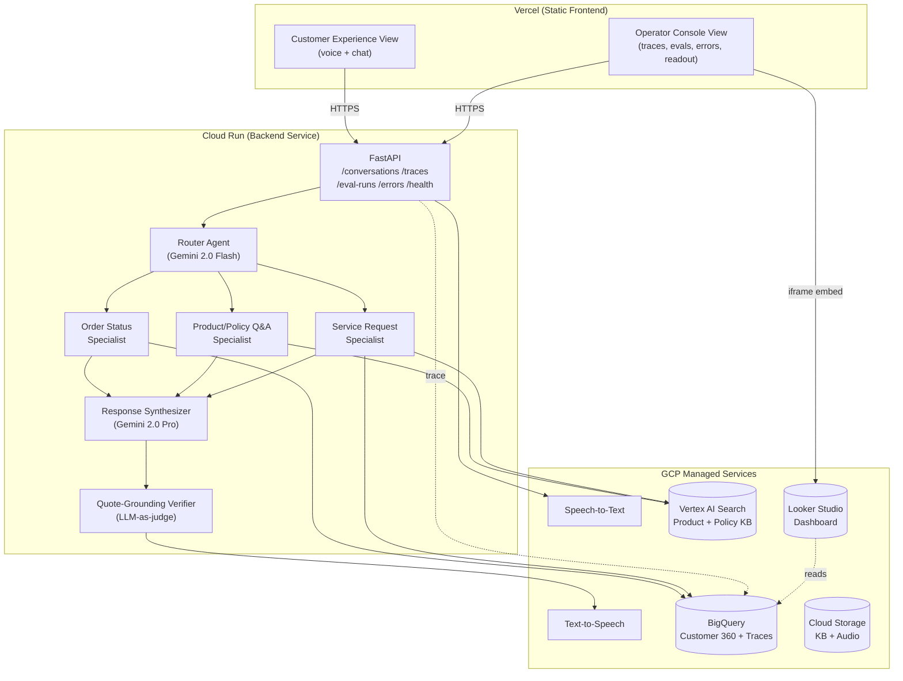

# ContactPulse — Architecture

> **Read first:** [`SPEC.md`](./SPEC.md) — concepts, journeys, surfaces, and modalities this document realizes.

---

## 1. System Overview

ContactPulse is a multi-agent conversational AI system on Google Cloud, with a first-class evaluation and observability layer. It is delivered as a single web application with two views — Customer Experience (the workload) and Operator Console (the data scientist's workspace) — sharing one backend.



The Vercel ↔ Cloud Run boundary is the only network hop the frontend crosses. Everything inside Cloud Run runs in-process. The Operator Console reads from the backend's `/traces`, `/eval-runs`, and `/errors` endpoints; the embedded Looker dashboard reads BigQuery directly.

---

## 2. GCP Services & Hosting Map

| Layer | Service | Why |
|---|---|---|
| Frontend hosting | **Vercel** (not GCP) | Zero-friction CI/CD, preview deploys, edge caching. The frontend is static asset delivery; no hiring signal lost by hosting outside GCP. |
| Voice in | Google Speech-to-Text | Industry-standard ASR; matches the stack production retail teams use. |
| Voice out | Google Text-to-Speech | Same. Pairs with STT for end-to-end voice loop. |
| Backend hosting | **Cloud Run** | Serverless, scales to zero, free tier covers demo, fits MVP cost profile. |
| Orchestration | Vertex AI Agent Development Kit (ADK), graph-based multi-agent | Native to Gemini Enterprise Agent Platform; explicit multi-agent coordination. |
| LLM (routing) | Gemini 2.0 Flash | Cheap, fast — production-realistic for high-volume intent routing. |
| LLM (synthesis & verification) | Gemini 2.0 Pro | Higher quality where it matters: response generation and grounding judgment. |
| Retrieval | Vertex AI Search | Native Gemini Enterprise integration; managed indexing and serving. |
| Hybrid retrieval augmentation | Custom RRF + cross-encoder reranker | Improves recall and precision over vanilla semantic search. |
| Data warehouse | BigQuery | Customer 360, orders, eval traces, conversation logs. SQL-native analytics. |
| Object storage | Cloud Storage | KB documents, audio recordings, eval artifacts. |
| Safety (PII) | Custom regex stub for MVP; Cloud DLP integration as future work | Demonstrates the layer without committing to full DLP cost. |
| Eval orchestration | Vertex AI Evaluation + custom LLM-as-judge | Hybrid: managed where it works, custom where rubrics need to be project-specific. |
| Observability | Cloud Logging + Cloud Trace + Looker Studio | Standard GCP observability stack. |
| CI/CD (backend) | GitHub Actions → Cloud Build → Cloud Run | Standard pattern; reproducible deploys. |
| CI/CD (frontend) | GitHub Actions → Vercel (auto-deploy on push to `main`) | Vercel's git integration handles this natively. |

### 2.1 Cloud Run Configuration (backend)

| Setting | Value | Rationale |
|---|---|---|
| Region | `us-central1` | Lowest Vertex latency from Atlanta; cheapest pricing tier. |
| Min instances | `1` | Avoid cold starts during the demo. Drop to `0` after the role is filled. |
| Max instances | `5` | Cost ceiling protection. |
| CPU | 1 vCPU | Sufficient for FastAPI + Vertex client. |
| Memory | 2 GiB | Handles concurrent requests + Gemini SDK overhead. |
| Concurrency | `10` | FastAPI async handles concurrency; multiple turns in flight per instance. |
| Timeout | `60s` | Gemini Pro tail latency can hit 15s; 60s gives headroom. |
| Authentication | Allow unauthenticated (MVP) | Lock down post-demo if extending. |
| Workload identity | Bound to `contactpulse-api@<project>.iam.gserviceaccount.com` | Least-privilege access to BQ, Vertex, Cloud Storage. |
| Ingress | All traffic | Vercel needs HTTPS access. |
| CORS | Allow `https://contactpulse.vercel.app` (and preview domains via regex) | No `*`. |

### 2.2 Vercel Configuration (frontend)

| Setting | Value |
|---|---|
| Framework preset | Vite |
| Build command | `npm run build` |
| Output directory | `dist` |
| Node version | `20` |
| Environment variable | `VITE_API_BASE_URL=https://contactpulse-api-XXXXXX-uc.a.run.app` |
| Auto-deploy branch | `main` |
| Preview deploys | Enabled (every PR) |

---

## 3. Repository Layout (Separation of Concerns)

```
contactpulse/
├── README.md                       # Public-facing project intro
├── SPEC.md                         # Product spec
├── ARCHITECTURE.md                 # This file
├── RUNBOOK.md                      # Operations
├── CLAUDE.md                       # Instructions for AI coding agents
├── pyproject.toml                  # Python deps
├── Dockerfile                      # Backend container
├── Makefile                        # Standard developer entry points
├── .env.example                    # Sample config, never with secrets
├── .github/workflows/
│   ├── ci.yml                      # Lint + tests + eval-as-test (backend & frontend)
│   └── deploy.yml                  # Cloud Run deploy (frontend auto-deploys via Vercel)
├── infra/
│   ├── terraform/                  # GCP resources (BQ, Cloud Run, Search index)
│   └── seed_data/                  # Synthetic data generators
├── backend/
│   ├── contactpulse/
│   │   ├── __init__.py
│   │   ├── config.py               # 12-factor: env-driven config (Pydantic Settings)
│   │   ├── logging_setup.py        # Structured JSON logging
│   │   ├── tracing.py              # Trace ID propagation
│   │   ├── concepts/               # One module per concept (SPEC §5)
│   │   │   ├── conversation.py
│   │   │   ├── intent_routing.py
│   │   │   ├── retrieval.py
│   │   │   ├── customer_context.py
│   │   │   ├── grounding.py
│   │   │   ├── escalation.py
│   │   │   ├── evaluation.py
│   │   │   └── observability.py
│   │   ├── agents/                 # Specialist agents per journey
│   │   │   ├── base.py             # Abstract Agent (Strategy pattern)
│   │   │   ├── router.py
│   │   │   ├── order_status.py
│   │   │   ├── product_qa.py
│   │   │   └── service_request.py
│   │   ├── llm/
│   │   │   ├── client.py           # Vertex AI Gemini client (single instance)
│   │   │   ├── prompts/            # All prompts as Jinja templates
│   │   │   └── circuit_breaker.py  # Resilience for LLM calls
│   │   ├── retrieval/
│   │   │   ├── vertex_search.py
│   │   │   ├── rrf.py
│   │   │   └── reranker.py
│   │   ├── data/
│   │   │   ├── bigquery_client.py
│   │   │   └── repositories/       # Repository pattern: data access abstracted
│   │   │       ├── customer.py
│   │   │       ├── order.py
│   │   │       ├── trace.py
│   │   │       └── eval_run.py
│   │   ├── api/
│   │   │   ├── main.py             # FastAPI entrypoint
│   │   │   ├── routes/
│   │   │   │   ├── conversation.py # POST /conversations, POST /conversations/{id}/turns (voice + chat)
│   │   │   │   ├── traces.py       # GET /traces, GET /traces/{trace_id}
│   │   │   │   ├── eval_runs.py    # GET /eval-runs, GET /eval-runs/{run_id}
│   │   │   │   ├── errors.py       # GET /errors/clusters
│   │   │   │   └── health.py
│   │   │   └── middleware.py       # Trace ID injection, logging, CORS
│   │   └── eval/
│   │       ├── runner.py           # Eval harness entrypoint
│   │       ├── metrics/
│   │       │   ├── intent.py
│   │       │   ├── retrieval.py
│   │       │   ├── grounding.py
│   │       │   ├── conversation.py
│   │       │   └── cost.py
│   │       ├── judges/             # LLM-as-judge rubrics
│   │       └── test_set.py         # Loads labeled queries
│   └── tests/
│       ├── unit/                   # Per-concept, per-agent
│       ├── integration/            # End-to-end with mocked LLMs
│       └── eval/                   # Eval-as-test (smoke version)
├── frontend/
│   ├── package.json
│   ├── vite.config.ts
│   ├── vercel.json                 # Vercel project config
│   ├── src/
│   │   ├── App.tsx                 # Top-level layout + routing
│   │   ├── main.tsx
│   │   ├── views/
│   │   │   ├── CustomerExperience/
│   │   │   │   ├── index.tsx
│   │   │   │   ├── ModalityToggle.tsx
│   │   │   │   ├── PushToTalk.tsx
│   │   │   │   ├── ChatInput.tsx
│   │   │   │   ├── Transcript.tsx
│   │   │   │   └── CustomerSelector.tsx
│   │   │   └── OperatorConsole/
│   │   │       ├── index.tsx
│   │   │       ├── LiveConversations.tsx
│   │   │       ├── TraceDrillDown.tsx
│   │   │       ├── EvalRuns.tsx
│   │   │       ├── ErrorAnalysis.tsx
│   │   │       └── BusinessReadout.tsx
│   │   ├── components/             # Shared UI primitives (Button, Card, Badge, Sparkline)
│   │   ├── api/
│   │   │   └── client.ts           # Single axios/fetch wrapper, env-driven base URL
│   │   └── lib/
│   │       └── traceId.ts
│   └── public/
├── notebooks/
│   ├── 01_synthetic_data_gen.ipynb
│   ├── 02_eval_walkthrough.ipynb
│   └── 03_error_analysis.ipynb     # The hero notebook
├── docs/
│   ├── business_readout.md         # Tech metrics → CX outcomes
│   └── images/                     # Architecture diagrams, dashboard screenshots
└── scripts/
    ├── bootstrap_gcp.sh            # One-shot project setup
    ├── seed_bigquery.py            # Populate synthetic customer/order data
    ├── index_kb.py                 # Build Vertex AI Search index
    └── run_eval.py                 # Eval harness CLI
```

**Single-responsibility rule:** every directory at depth 2 owns one concept or one cross-cutting concern. Cross-references go through interfaces, not direct imports.

**Frontend rule:** no business logic in `views/`. Views are presentational; data fetching goes through `api/client.ts` and lives in TanStack Query hooks.

---

## 4. Request Lifecycle

### 4.1 A Customer turn (voice or chat)
1. **Ingress** — Customer pushes to talk (voice) or sends a message (chat). Hits `POST /conversations/{trace_id}/turns` with `{modality, payload}`.
2. **Trace allocation** — Middleware extracts or assigns a trace ID; injects into the logging context.
3. **STT (voice only)** — Audio → text via Speech-to-Text client.
4. **Customer context fetch** — `CustomerContextRepository` looks up caller in BigQuery (cached per-conversation).
5. **Routing** — `RouterAgent` classifies intent + journey + confidence.
6. **Confidence gate** — If confidence < `ROUTER_CONFIDENCE_THRESHOLD`, escalate.
7. **Specialist dispatch** — Strategy pattern picks `OrderStatusAgent` | `ProductQAAgent` | `ServiceRequestAgent`.
8. **Tool calls** — Specialist calls retrieval and/or BigQuery as needed.
9. **Synthesis** — Synthesizer agent (Gemini Pro) drafts a response with explicit citations.
10. **Grounding verification** — Verifier checks each claim. If ungrounded → refuse + escalate.
11. **TTS (voice only)** — Text → audio.
12. **Response** — `{text, audio_url?, trace_id, agent_metadata}` returned to client.
13. **Trace flush** — All events for this turn persist to BigQuery via the trace sink.

### 4.2 An Operator action
- **Live conversations list** — `GET /traces?since=<ts>&limit=50` returns a paginated summary view.
- **Drill-down** — `GET /traces/{trace_id}` returns the full event chain for one conversation.
- **Eval runs** — `GET /eval-runs?limit=20` returns a summary; `GET /eval-runs/{run_id}` returns the full breakdown.
- **Error clusters** — `GET /errors/clusters` returns categorized failure samples.

Every endpoint emits a structured log record with the trace ID. Every LLM call records: model, input tokens, output tokens, latency, cost.

---

## 5. Data Model

All synthetic. Schemas are deliberately small for MVP.

### `customers` (BigQuery)
| Column | Type | Notes |
|---|---|---|
| customer_id | STRING | UUID |
| name | STRING | Synthetic |
| phone | STRING | Synthetic, regex-redactable |
| loyalty_tier | STRING | bronze / silver / gold |
| created_at | TIMESTAMP | |

### `orders`
| Column | Type | Notes |
|---|---|---|
| order_id | STRING | |
| customer_id | STRING | FK |
| sku | STRING | |
| quantity | INT64 | |
| status | STRING | placed / shipped / delivered / returned |
| placed_at | TIMESTAMP | |
| eta | TIMESTAMP | |

### `service_requests`
| Column | Type | Notes |
|---|---|---|
| request_id | STRING | |
| customer_id | STRING | FK |
| service_type | STRING | install / repair / consultation |
| status | STRING | requested / scheduled / completed / cancelled |
| scheduled_for | TIMESTAMP | |

### `conversation_traces`
| Column | Type | Notes |
|---|---|---|
| trace_id | STRING | One per conversation |
| turn_index | INT64 | |
| timestamp | TIMESTAMP | |
| modality | STRING | voice / chat |
| event_type | STRING | router / retrieval / synthesis / verification / tts / escalation |
| event_payload | JSON | Full event detail |
| latency_ms | INT64 | |
| llm_input_tokens | INT64 | |
| llm_output_tokens | INT64 | |
| llm_cost_usd | NUMERIC | |

### `eval_runs`
| Column | Type | Notes |
|---|---|---|
| run_id | STRING | |
| run_timestamp | TIMESTAMP | |
| git_sha | STRING | |
| config_hash | STRING | |
| metric_name | STRING | |
| metric_value | FLOAT64 | |
| journey | STRING | per-journey metrics |

---

## 6. 12-Factor Compliance

| Factor | How ContactPulse complies |
|---|---|
| **I. Codebase** | Single Git repo. Frontend and backend in subdirectories; one repo per app. |
| **II. Dependencies** | All Python deps in `pyproject.toml`; all JS in `package.json`. No system-wide installs. Container is the unit of dependency. |
| **III. Config** | Every environment-varying value lives in env vars. Backend: `Settings` via Pydantic. Frontend: `import.meta.env.VITE_*`. `.env.example` documents the full set. |
| **IV. Backing services** | BigQuery, Vertex AI, Vertex Search, Cloud Storage are all attached resources reachable via env-var URIs. Switchable per environment. |
| **V. Build, release, run** | Backend: Dockerfile builds, GitHub Actions tags releases, Cloud Run runs the released image. Frontend: Vite builds, Vercel hosts. Strict separation. |
| **VI. Processes** | Backend is stateless. All state lives in BigQuery / Vertex Search / Cloud Storage. Sessions are cookie-less; trace IDs are issued per call. |
| **VII. Port binding** | Cloud Run injects `$PORT`; FastAPI binds to it. No hardcoded ports. |
| **VIII. Concurrency** | Cloud Run scales horizontally via process model. Eval harness runs as Cloud Run Jobs, not in the API container. |
| **IX. Disposability** | Container starts in <2s. SIGTERM handling drains in-flight requests. No sticky state. |
| **X. Dev/prod parity** | Same Docker image runs locally (via `docker compose`) and in Cloud Run. Same Python version, same dependencies. Frontend: Vite dev server matches Vercel build. |
| **XI. Logs** | Structured JSON to stdout. Cloud Logging captures automatically. No log files on disk. |
| **XII. Admin processes** | Eval runs, data seeding, KB indexing are one-off scripts in `scripts/` runnable via the same image. Never in the API container. |

---

## 7. Configuration

Single source of truth: `backend/contactpulse/config.py`.

```python
# Sketch — full implementation in config.py
from pydantic_settings import BaseSettings

class Settings(BaseSettings):
    # GCP
    gcp_project_id: str
    gcp_region: str = "us-central1"

    # Models
    model_router: str = "gemini-2.0-flash"
    model_synthesizer: str = "gemini-2.0-pro"
    model_verifier: str = "gemini-2.0-pro"

    # Thresholds
    router_confidence_threshold: float = 0.7
    grounding_min_score: float = 0.8
    max_turns_per_conversation: int = 12

    # Vertex AI Search
    search_engine_id: str
    search_serving_config: str = "default_config"

    # BigQuery
    bq_dataset: str = "contactpulse"

    # Eval
    eval_test_set_path: str = "gs://contactpulse-evals/test_set_v1.jsonl"

    # CORS — comma-separated allow list
    cors_allowed_origins: str = "https://contactpulse.vercel.app"

    class Config:
        env_file = ".env"
        env_prefix = "CONTACTPULSE_"
```

**Rules:**
- No hardcoded model names, thresholds, dataset names, or URIs anywhere in code. All come from `Settings`.
- New config knobs require a default and an entry in `.env.example`.
- Secrets never live in `Settings`; use Secret Manager + ADC (Application Default Credentials).

Frontend env vars (in Vercel):
- `VITE_API_BASE_URL` — backend Cloud Run URL.

---

## 8. Secrets Management

- GCP service account credentials via Application Default Credentials. Never committed.
- Local development: `gcloud auth application-default login`.
- Cloud Run: workload identity binds the service to a service account.
- Vercel: no secrets needed for the frontend (all config is public env vars).
- `.gitignore` blocks `.env`, `*.json` (service account keys), and the `secrets/` directory.

---

## 9. Logging & Observability

### Structured Logging
- JSON to stdout. Every log record includes: `trace_id`, `turn_index`, `concept`, `event_type`, `latency_ms`, `cost_usd` (when applicable).
- Standard Python `logging` configured via `logging_setup.py`. No third-party logging framework.

### Tracing
- One `trace_id` per conversation, propagated via context vars.
- Every LLM call, retrieval call, BigQuery query emits an event with the trace ID.
- Cloud Trace ingests automatically; spans visible in GCP console.

### Operator Console (in-app observability)
- The Operator Console is the *primary* observability surface for non-GCP-savvy users.
- Live Conversations refreshes every 5s.
- Trace Drill-Down loads the full chain for one trace_id.
- Error Analysis groups failed conversations by category.

### Looker Studio (embedded)
- Embedded as iframe in the Business Readout sub-view.
- Reads `eval_runs` and `conversation_traces` directly via BigQuery connector.
- No custom chart code in the React app.

### Cloud Monitoring (operational)
- Real-time ops view: request rate, error rate, p50/p95 latency.
- Used by the developer, not surfaced in the Operator Console.

---

## 10. Testing Strategy

A test pyramid, with eval-as-test on top.

### Unit (`backend/tests/unit/`)
- One test file per concept module and per agent.
- LLM clients mocked. Retrieval clients mocked. BigQuery clients mocked.
- Fast: full unit suite < 30 seconds.
- **Required for every new function with non-trivial logic.**

### Integration (`backend/tests/integration/`)
- End-to-end conversation flows with **mocked LLM responses** (recorded via VCR-style fixtures).
- Real BigQuery client against a test dataset.
- Verifies the full request lifecycle for both modalities (voice + chat).

### Eval-as-test (`backend/tests/eval/`)
- A smoke version of the eval harness over ~10 hand-picked queries (chat modality).
- Uses **real Gemini calls** (gated by an env var to avoid cost in CI by default).
- Asserts containment ≥ floor, hallucination ≤ ceiling.
- Run on PRs touching prompts, agents, or retrieval.

### Frontend tests (`frontend/src/__tests__/`)
- Component tests with React Testing Library.
- API client mocked.
- Smoke test: app renders, both views accessible, mock data displays.

### Full eval harness (`backend/contactpulse/eval/`)
- Not a unit test — a separate runner invoked manually or via Cloud Run Jobs.
- 150+ queries (chat modality), real Gemini calls, full metrics.
- Results to BigQuery, dashboard updates automatically.

---

## 11. Design Patterns Used

| Pattern | Where | Why |
|---|---|---|
| **Strategy** | `agents/base.py` defines `Agent`; specialists implement it. Router selects at runtime. | Adding a new journey is a new strategy class. |
| **Chain of Responsibility** | Router → Specialist → Synthesizer → Verifier. Each step can short-circuit. | Linear, debuggable flow. Easy to insert new steps. |
| **Repository** | `data/repositories/` abstracts BigQuery access. | Tests mock the repository; production hits BigQuery. |
| **Factory** | `agents/router.py` returns specialist agents by intent. | Centralizes the agent registry; new agents register here. |
| **Circuit Breaker** | `llm/circuit_breaker.py` wraps Gemini calls. Trips on repeated failures, falls back to refusal. | LLM APIs fail. Production systems must degrade gracefully. |
| **Pydantic contracts** | All inter-module data is a Pydantic model. | Type safety, runtime validation, auto-documentation. |
| **Template method** | Base `Agent.handle()` orchestrates pre-hook → specialist logic → post-hook. Subclasses override the middle. | Common observability/logging is defined once. |
| **MVVM (frontend)** | Views are presentational; data via TanStack Query hooks. | Views never call APIs directly; testable in isolation. |

---

## 12. Cost & Scale Considerations

### MVP cost ceiling: $50 (well within $300 free tier)
- Vertex AI: Gemini 2.0 Flash (router) ~$0.0001/call; Pro (synthesis + verifier) ~$0.001/call. 1000 dev calls ~$5.
- BigQuery: free tier covers MVP volumes.
- Vertex AI Search: ~$2/GB/month for the small KB.
- Cloud Run: free tier covers demo traffic; min instances = 1 adds <$5/month.
- Cloud Storage: pennies.
- Vercel: free tier.

### Cost-per-call analysis (back-of-envelope)
- Router (Flash, ~200 input + ~50 output tokens): ~$0.00007
- Synthesis (Pro, ~1500 input + ~150 output tokens): ~$0.0008
- Verifier (Pro, ~1000 input + ~50 output tokens): ~$0.0005
- **Total LLM cost per turn: ~$0.0014**

At 1M calls/year, LLM cost ≈ $1,400. Compared to associate handle time at ~$0.50/min × 5 min = $2.50/call, displaced cost ≈ $2.5M/year.

### Scaling considerations (called out, not built)
- Long-running specialist agents could move to ADK Agent Runtime instead of Cloud Run.
- Vertex AI Search scales to enterprise corpora natively.
- BigQuery is effectively unbounded for our analytics use case.
- The bottleneck at scale is the cross-encoder reranker; would replace with a fine-tuned smaller model.

---

## 13. Security & Privacy

- **No real customer data.** All data is synthetic.
- **PII redaction:** regex-based stub at the input boundary. Cloud DLP is the production replacement.
- **Prompt injection mitigation:** structured prompts with explicit `<system_instruction>` boundaries; specialist agents reject inputs containing instruction-like patterns ("ignore previous instructions").
- **Output safety:** the grounding verifier acts as a content guardrail in addition to a hallucination check.
- **Audit trail:** every conversation persisted with a trace ID; eval runs are git-sha-tagged.
- **No retailer trademarks.** All references are to "home improvement retail" generically.
- **CORS:** explicit allow list. Vercel domain + preview domain regex. Never `*`.
