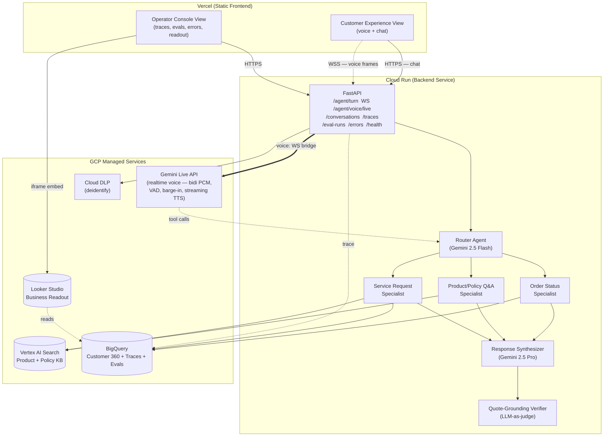

# ContactPulse

> Measurement and improvement framework for production conversational AI agents in retail customer experience — built on Google Cloud. The voice/chat agent exists to give the eval harness something to measure. **The eval harness is the hero.**

[](https://contactpulse.vercel.app)
[](https://www.loom.com/share/contactpulse)
[](https://github.com/charanyellanki/ContactPulse)

> Portfolio project. Synthetic data only. No real customer information, no retailer branding.

---

## What it measures

Six headline metrics, each with a target. Live numbers come from the eval harness on a labeled 150-query test set, written to BigQuery and rendered in the Operator Console.

- **Containment rate** — share of conversations resolved without human handoff. _Target ≥ 60%._
- **Refusal precision** — when the agent says "I don't know" or escalates, how often it's right. _Primary guardrail. Target ≥ 90%._
- **Task success — Order Status (J1)** — happy-path "where's my order?" resolution. _Target ≥ 85%._
- **Task success — Product/Policy Q&A (J2)** — answer-or-refuse on KB-backed questions. _Target ≥ 70%._
- **Task success — Service Request (J3)** — multi-turn slot-filling, intentionally hard. _Target ≥ 50%._
- **Hallucination rate (post-verifier)** — share of responses making claims not grounded in retrieved context, after the LLM-as-judge verifier. _Target ≤ 5%._

---

## Architecture



The Vercel ↔ Cloud Run boundary is the only network hop the frontend crosses. Everything inside Cloud Run runs in-process.

---

## Eval — what's measured and how

The eval harness (`python -m backend.evals.eval_runner`) runs the full 150-query labeled test set ([backend/evals/test_set.jsonl](backend/evals/test_set.jsonl)) through the agent pipeline, calls a Gemini-Flash LLM-as-judge per query, and writes one row to `contactpulse.eval_runs` keyed by `git_sha` plus per-query JSONL to `gs://${PROJECT}-contactpulse-evals/runs/<run_id>/`.

| Metric | Target | How it's measured |
|---|---|---|
| Containment rate | ≥ 60% | Share of queries whose response is neither a refusal nor an escalation. |
| Refusal precision | ≥ 90% | Of queries the agent refused, share where the test set expected a refusal. |
| Intent accuracy | ≥ 85% | Router intent vs. the test set's `expected_intent` label. |
| Retrieval hit-rate | ≥ 80% | Share of retrieval-bearing queries where at least one passage's reranker score clears `RETRIEVAL_HIT_THRESHOLD` (0.5). Order-status queries (no retrieval) are excluded from the denominator. |
| Hallucination rate (post-verifier) | ≤ 5% | Share of responses the LLM-as-judge flagged as containing claims unsupported by the agent's context, after the grounding verifier had its retry. |
| Task success — Order Status | ≥ 85% | LLM-as-judge `task_success ∈ {resolved, partial, failed}` averaged with `{1.0, 0.5, 0.0}` weights, scoped to the journey. |
| Task success — Product/Policy Q&A | ≥ 70% | Same, scoped to product_qa. |
| Task success — Service Request | ≥ 50% | Same, scoped to service_request (intentionally hard — multi-turn slot-filling). |
| Latency p50 / p95 | p95 ≤ 4s | Per-turn wall-clock latency. |
| Cost per call | reported, not gated | **Mean of measured per-query cost** — sum of every LLM call's `cost_usd` (router + specialist synthesis + grounding verifier + retry-attempts + the eval judge), captured from trace events on each query, averaged over the run. |

The numbers above are the **targets** the harness asserts against, not headline marketing claims. Latest measured run is published in BigQuery (`contactpulse.eval_runs ORDER BY created_at DESC LIMIT 1`) and surfaced in the Operator Console's **Eval Runs** view; run history is the diff signal, not a static table in this README.

The eval row also stores `git_sha` and `config_hash` so prompt or threshold changes are diffable across runs.

---

## GCP stack

| Layer | Service | Why |
|---|---|---|
| Frontend hosting | **Vercel** | Zero-friction CI/CD, preview deploys, edge caching. Static asset delivery. |
| Backend hosting | **Cloud Run** (`us-central1`) | Serverless, scales to zero, fits MVP cost profile. |
| Voice (realtime) | **Vertex AI Gemini Live API** (`gemini-live-2.5-flash-native-audio`) | Bidirectional PCM streaming, server VAD, native barge-in, streaming TTS, tool calls — all in one model. Replaces the v1.3 STT v2 + TTS v1 batch helpers. |
| LLM — routing | **Gemini 2.5 Flash** | Cheap, fast — production-realistic for high-volume intent classification. |
| LLM — synthesis & verification | **Gemini 2.5 Pro** | Higher quality where it matters: response generation and grounding judgment. |
| Retrieval | **Vertex AI Search** + custom RRF/reranker | Hybrid retrieval over synthetic product + policy KB. |
| Data warehouse | **BigQuery** | Customer 360, orders, conversation traces, eval runs. |
| Object storage | **Cloud Storage** | KB documents, audio recordings, eval artifacts. |
| PII redaction | **Cloud DLP** + circuit-broken regex fallback | De-identification at the input boundary, before any prompt sees the utterance. |
| Eval orchestration | **Vertex AI Evaluation** + custom LLM-as-judge | Hybrid: managed where it works, custom where rubrics need to be project-specific. |
| Observability | **Cloud Logging + Cloud Trace + Looker Studio** | Standard GCP observability stack. |
| CI/CD (backend) | GitHub Actions → Cloud Build → Cloud Run | Reproducible deploys. |
| CI/CD (frontend) | GitHub Actions → Vercel | Vercel's git integration. |

---

## Business readout

A large home-improvement retailer handles roughly **100M customer contacts per year** — about **270k contacts/day**. Industry agent-handle-time costs run **~$0.85/min** loaded, with average voice handle time around **6 minutes**.

For **each percentage-point of containment improvement** the agent delivers over the human-only baseline:

- **~2,700 contacts/day** newly contained that previously went to a human agent.
- **~16,200 agent-minutes/day** displaced (at 6 min/contact).
- **~$13,800/day** in avoided agent-handle-time at $0.85/min.
- **~$5.0M/year** at full retailer scale.

So a 5-point containment lift (a realistic landing zone for a grounded, verifier-gated agent on KB-shaped traffic) maps to roughly **$25M/year** in avoided handle-time at this volume. Run-the-platform LLM cost is the per-call estimate × annual volume — at the harness's measured `cost_per_call_usd` this is in the low millions/year, leaving an order-of-magnitude gap. The eval harness exists so a CX data-science team can defend that number to the business with daily evidence rather than a quarterly survey: every eval run is a row in BigQuery tagged with `git_sha`, so containment / refusal-precision / hallucination-rate movement is attributable to specific prompt or threshold changes.

---

## What I'd build next

- **Telephony (PSTN/SIP).** Bridge **Twilio Media Streams** in front of the existing `WS /agent/voice/live` socket so callers on a real phone number hit the same Gemini Live session the web demo uses.
- **A/B framework** with shadow traffic — run **Gemini Flash vs Pro** on synthesis with one cohort live and the other shadowed, surface containment + cost deltas in the Operator Console, gate promotion on stat-sig improvement.
- **Fine-tuning on the product catalog** — a small adapter on Gemini for product-attribute Q&A would close most of the J2 retrieval-miss cluster without changing the prompt.
- **Cloud DLP on audio frames.** Today DLP runs over the Live transcript text. A streaming DLP integration that redacts PII *inside* the inbound audio buffer before Gemini sees it would close the residual leak window.
- **Vertex AI Feature Store** for Customer 360 signals — replace the synchronous BigQuery `customers_context` lookup with a low-latency online feature store, freeing 100–300ms from the p95 budget.
- **Vertex AI Conversational Insights integration** — write `conversation_traces` rows into the schema Conversational Insights consumes, so the in-app Operator Console becomes a thin wedge of the same surface a CX data-science team would use in production at a large retailer.
- **Vertex AI Agent Engine deployment** — promote the ADK app from Cloud Run to Agent Engine for managed agent-specific scaling, auth, and built-in tracing.

---

## Running locally

```bash
# 1. Configure (one-time)
cp .env.example .env                   # set CONTACTPULSE_PROJECT_ID
gcloud auth application-default login

# 2. Install
poetry install
cd frontend && npm install && cd ..

# 3. Seed BigQuery + KB (synthetic data only)
poetry run python backend/scripts/seed_bigquery.py
poetry run python scripts/build_test_set.py

# 4. Run
make dev-backend                       # uvicorn :8000
make dev-frontend                      # vite :5173
```

Visit `http://localhost:5173` — Customer Experience by default; `/operator` for the Operator Console.

Full setup, GCP bootstrap, deploy, eval, and rollback procedures: [`RUNBOOK.md`](./RUNBOOK.md).
Spec, journeys, and metric definitions: [`SPEC.md`](./SPEC.md).
System design and deployment shape: [`ARCHITECTURE.md`](./ARCHITECTURE.md).

---

## License

[MIT](./LICENSE)
