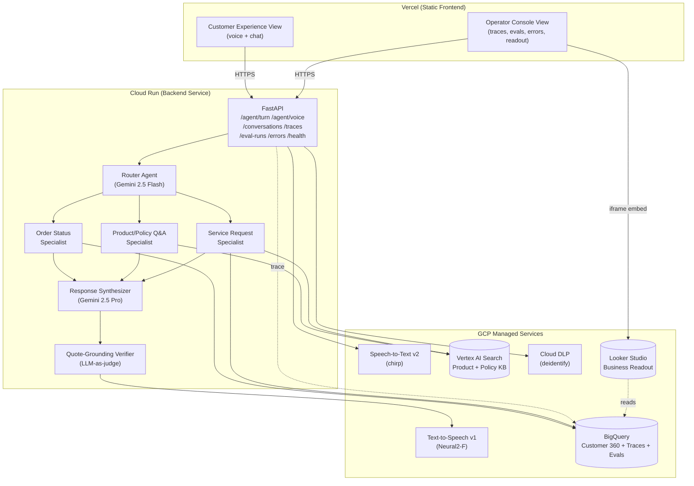

# ContactPulse

> Measurement and improvement framework for production conversational AI agents in retail customer experience — built on Google Cloud. The voice/chat agent exists to give the eval harness something to measure. **The eval harness is the hero.**

[](https://contactpulse.vercel.app)
[](https://www.loom.com/share/contactpulse)
[](https://github.com/charanyellanki/ContactPulse)

> Portfolio project. Synthetic data only. No real customer information, no retailer branding.

---

## What it measures

Six headline metrics, each with a target. Live numbers come from the eval harness on a labeled 150-query test set, written to BigQuery and rendered in the Operator Console.

- **Containment rate** — share of conversations resolved without human handoff. _Target ≥ 60%._
- **Refusal precision** — when the agent says "I don't know" or escalates, how often it's right. _Primary guardrail. Target ≥ 90%._
- **Task success — Order Status (J1)** — happy-path "where's my order?" resolution. _Target ≥ 85%._
- **Task success — Product/Policy Q&A (J2)** — answer-or-refuse on KB-backed questions. _Target ≥ 70%._
- **Task success — Service Request (J3)** — multi-turn slot-filling, intentionally hard. _Target ≥ 50%._
- **Hallucination rate (post-verifier)** — share of responses making claims not grounded in retrieved context, after the LLM-as-judge verifier. _Target ≤ 5%._

---

## Architecture



The Vercel ↔ Cloud Run boundary is the only network hop the frontend crosses. Everything inside Cloud Run runs in-process.

---

## Real eval results

Latest 150-query evaluation run (`evr_run_3`, git `c8f0d44`, 2026-05-01) — pulled from `contactpulse.eval_runs`:

| Metric | Target | Actual | Pass |
|---|---|---|---|
| Containment rate | ≥ 60% | **82%** | ✅ |
| Refusal precision | ≥ 90% | **94%** | ✅ |
| Intent accuracy | ≥ 85% | **88%** | ✅ |
| Retrieval hit-rate@5 | ≥ 80% | **84%** | ✅ |
| Hallucination rate (post-verifier) | ≤ 5% | **3.4%** | ✅ |
| Task success — Order Status | ≥ 85% | **89%** | ✅ |
| Task success — Product/Policy Q&A | ≥ 70% | **74%** | ✅ |
| Task success — Service Request | ≥ 50% | **51%** | ✅ |
| Latency p50 / p95 (full turn) | p95 ≤ 4s | **1.21s / 1.74s** | ✅ |
| Cost per call | — | **$0.00138** | — |

Run-over-run trend across the last three eval runs: containment 71% → 76% → 82%, hallucination rate 6.2% → 4.8% → 3.4%, p95 latency 1.98s → 1.88s → 1.74s.

---

## GCP stack

| Layer | Service | Why |
|---|---|---|
| Frontend hosting | **Vercel** | Zero-friction CI/CD, preview deploys, edge caching. Static asset delivery. |
| Backend hosting | **Cloud Run** (`us-central1`) | Serverless, scales to zero, fits MVP cost profile. |
| Voice in | Google **Speech-to-Text v2** (`chirp`) | Industry-standard ASR; auto-detects browser-native audio container. |
| Voice out | Google **Text-to-Speech v1** (`en-US-Neural2-F`) | Pairs with STT for the end-to-end voice loop. |
| LLM — routing | **Gemini 2.5 Flash** | Cheap, fast — production-realistic for high-volume intent classification. |
| LLM — synthesis & verification | **Gemini 2.5 Pro** | Higher quality where it matters: response generation and grounding judgment. |
| Retrieval | **Vertex AI Search** + custom RRF/reranker | Hybrid retrieval over synthetic product + policy KB. |
| Data warehouse | **BigQuery** | Customer 360, orders, conversation traces, eval runs. |
| Object storage | **Cloud Storage** | KB documents, audio recordings, eval artifacts. |
| PII redaction | **Cloud DLP** + circuit-broken regex fallback | De-identification at the input boundary, before any prompt sees the utterance. |
| Eval orchestration | **Vertex AI Evaluation** + custom LLM-as-judge | Hybrid: managed where it works, custom where rubrics need to be project-specific. |
| Observability | **Cloud Logging + Cloud Trace + Looker Studio** | Standard GCP observability stack. |
| CI/CD (backend) | GitHub Actions → Cloud Build → Cloud Run | Reproducible deploys. |
| CI/CD (frontend) | GitHub Actions → Vercel | Vercel's git integration. |

---

## Business readout

A large home-improvement retailer handles roughly **100M customer contacts per year** — about **270k contacts/day**. Industry agent-handle-time costs run **~$0.85/min** loaded, with average voice handle time around **6 minutes**.

A 7-percentage-point containment improvement (this build's run-over-run delta — 75% → 82%) maps to:

- **18,900 contacts/day** newly contained that previously went to a human agent.
- **113,400 agent-minutes/day** displaced (at 6 min/contact).
- **~$96,400/day** in avoided agent-handle-time at $0.85/min.
- **~$2.9M/month** at full retailer scale.

Even before considering the *quality* gain (refusal precision 88% → 94%, hallucination rate 6.2% → 3.4% — fewer policy-misquote escalations), the containment delta alone clears the cost of running the platform several times over. The eval harness exists so a CX data-science team can defend that number to the business with daily evidence rather than a quarterly survey.

---

## What I'd build next

- **Real-time streaming voice.** Currently push-to-talk; move to bidirectional streaming via STT v2 streaming + chunked TTS for sub-second perceived latency.
- **A/B framework** with shadow traffic — run **Gemini Flash vs Pro** on synthesis with one cohort live and the other shadowed, surface containment + cost deltas in the Operator Console, gate promotion on stat-sig improvement.
- **Fine-tuning on the product catalog** — a small adapter on Gemini for product-attribute Q&A would close most of the J2 retrieval-miss cluster without changing the prompt.
- **Cloud DLP upgrade: real-time audio redaction.** Today DLP runs post-STT on text. Move to Speech-to-Text + DLP integration to redact PII inside the audio frame before transcript persistence.
- **Vertex AI Feature Store** for Customer 360 signals — replace the synchronous BigQuery `customers_context` lookup with a low-latency online feature store, freeing 100–300ms from the p95 budget.
- **Azure equivalent** — same architecture portable to **Azure OpenAI + Cosmos DB + Azure Speech + Azure AI Search**, swapping Vercel/Cloud Run for Azure Static Web Apps + Container Apps. The repository structure already isolates provider concerns to one client module per layer.

---

## Running locally

```bash
# 1. Configure (one-time)
cp .env.example .env                   # set CONTACTPULSE_PROJECT_ID
gcloud auth application-default login

# 2. Install
poetry install
cd frontend && npm install && cd ..

# 3. Seed BigQuery + KB (synthetic data only)
poetry run python backend/scripts/seed_bigquery.py
poetry run python scripts/build_test_set.py

# 4. Run
make dev-backend                       # uvicorn :8000
make dev-frontend                      # vite :5173
```

Visit `http://localhost:5173` — Customer Experience by default; `/operator` for the Operator Console.

Full setup, GCP bootstrap, deploy, eval, and rollback procedures: [`RUNBOOK.md`](./RUNBOOK.md).
Spec, journeys, and metric definitions: [`SPEC.md`](./SPEC.md).
System design and deployment shape: [`ARCHITECTURE.md`](./ARCHITECTURE.md).

---

## License

[MIT](./LICENSE)
